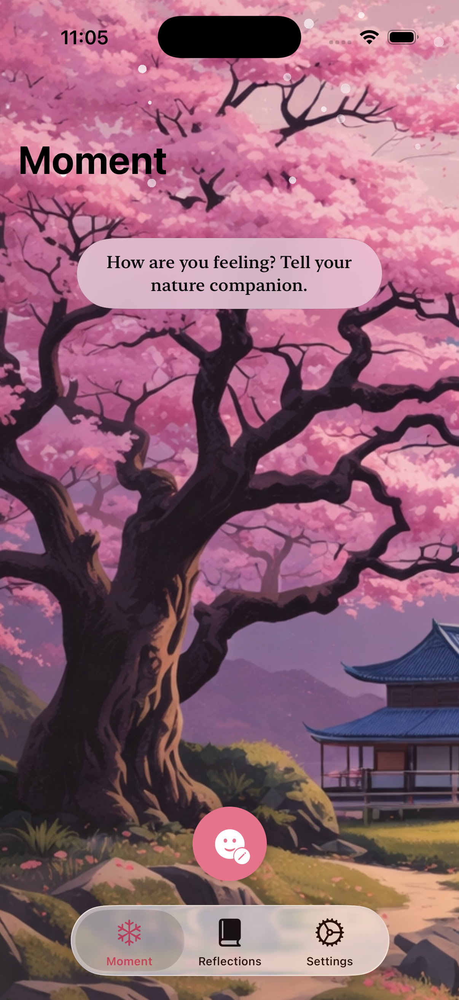
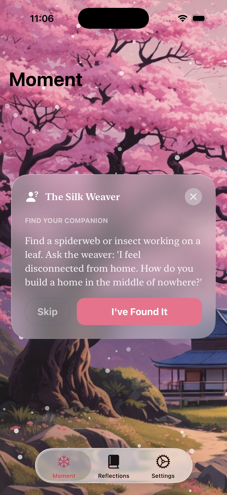
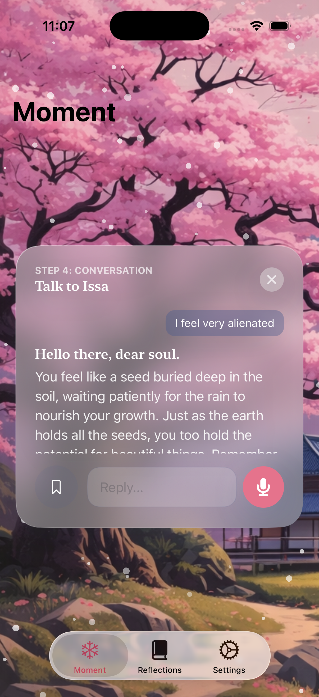
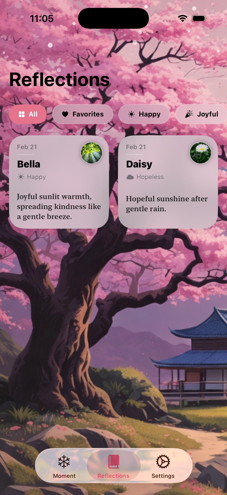

  

<h1 align="center">🌸 Sylva</h1>

<b>Sometimes, all we need is someone who listens. Nature always has.</b>

An AI-powered mindfulness companion that transforms moments in nature into meaningful conversations.

---

## 🌿 About

Sylva is an AI-powered mindfulness app that encourages users to reconnect with nature through guided reflection.

Instead of journaling into an empty text box, Sylva invites you to step outside, find a companion in nature—a tree, flower, bird, or even a spider weaving its web—and begin a thoughtful conversation inspired by that companion.

Every interaction becomes a moment of mindfulness, helping users slow down, reflect, and rediscover themselves through the wisdom of nature.

---

# ✨ Features

## 🌸 Moment

Begin your reflection by selecting how you're feeling.

Sylva maps your emotions to a unique nature companion and guides you toward a mindful experience.

---

## 😊 Mood Selection

Choose from a wide range of emotions.

- Happy
- Joyful
- Calm
- Excited
- Proud
- Exhausted
- Hopeless
- Anxious
- Overwhelmed
- Isolated

Each emotion unlocks a different companion and conversation.

---

## 🌿 Find Your Companion

Before talking to AI, Sylva encourages you to disconnect from your phone and reconnect with the world around you.

For example:

> Find a spider weaving its web and ask:
>
> *"How do you build a home in the middle of nowhere?"*

This simple activity creates presence before reflection begins.

---

## 💬 AI Conversation

Chat naturally with your companion.

Rather than offering generic advice, Sylva responds through metaphors inspired by nature, encouraging reflection instead of instruction.

Supports:

- Natural conversation
- Voice input
- Follow-up discussions

---

## 📖 Reflection Journal

Every conversation is automatically saved.

Browse previous reflections using emotion filters or revisit your favorite conversations anytime.

---

## ❤️ Saved Conversations

Open any previous reflection to revisit the complete conversation, favorite meaningful moments, or remove entries when desired.

---

# 🛠 Tech Stack

- SwiftUI
- Foundation Models
- Apple Intelligence
- Swift Concurrency (async/await)
- MVVM Architecture

---

# 🎨 Design Philosophy

Sylva is built around three simple ideas.

🌸 **Presence over productivity**

🍃 **Nature over notifications**

🤍 **Reflection over perfection**

Every animation, interaction, and visual element is intentionally calm, encouraging users to slow down instead of rushing through another app.

---

# 🤍 Why Sylva?

Many wellness apps ask users to write into a blank journal.

Sylva encourages them to step outside, observe the world around them, and discover that every tree, flower, bird, stream, or spider has a story worth listening to.

Because sometimes healing doesn't begin with advice.

It begins with noticing.

---

<b>"Go outside. Find your companion. Start a conversation."</b> 🌸

